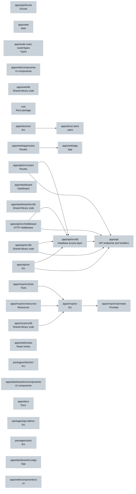

# switchboard-flags dependency graph

> Generated by [stacklit](https://github.com/glincker/stacklit) on 2026-04-19. Run `stacklit generate` to update.

```mermaid
graph LR
  classDef typescript fill:#c9d1d9,color:#0d1117,stroke:#c9d1d9
  classDef javascript fill:#c9d1d9,color:#0d1117,stroke:#c9d1d9
  apps_api_drizzle["apps/api/drizzle<br/>Drizzle"]:::typescript
  apps_web["apps/web<br/>Web"]:::typescript
  apps_web_react_router_types["apps/web/.react-router/types<br/>Types"]:::typescript
  apps_web_components["apps/web/components<br/>UI components"]:::typescript
  apps_web_lib["apps/web/lib<br/>Shared library code"]:::typescript
  root["root<br/>Root package"]:::typescript
  apps_api_src_lib["apps/api/src/lib<br/>Shared library code"]:::typescript
  apps_docs_src["apps/docs/src<br/>Src"]:::typescript
  apps_mcp_src_lib["apps/mcp/src/lib<br/>Shared library code"]:::typescript
  apps_dashboard["apps/dashboard<br/>Dashboard"]:::typescript
  apps_dashboard_src_lib["apps/dashboard/src/lib<br/>Shared library code"]:::typescript
  apps_mcp_src["apps/mcp/src<br/>Src"]:::typescript
  apps_api_src["apps/api/src<br/>Src"]:::typescript
  apps_api_src_middleware["apps/api/src/middleware<br/>HTTP middleware"]:::typescript
  apps_api_src_routes["apps/api/src/routes<br/>Routes"]:::typescript
  apps_docs_astro["apps/docs/.astro<br/>.astro"]:::typescript
  apps_api["apps/api<br/>API endpoints and handlers"]:::typescript
  apps_mcp_src_prompts["apps/mcp/src/prompts<br/>Prompts"]:::typescript
  apps_mcp_src_resources["apps/mcp/src/resources<br/>Resources"]:::typescript
  apps_mcp_src_tools["apps/mcp/src/tools<br/>Tools"]:::typescript
  apps_web_app["apps/web/app<br/>App"]:::typescript
  apps_api_src_db["apps/api/src/db<br/>Database access layer"]:::typescript
  apps_web_app_routes["apps/web/app/routes<br/>Routes"]:::typescript
  apps_web_hooks["apps/web/hooks<br/>React hooks"]:::typescript
  packages_client_src["packages/client/src<br/>Src"]:::typescript
  apps_dashboard_src_components["apps/dashboard/src/components<br/>UI components"]:::typescript
  apps_docs["apps/docs<br/>Docs"]:::typescript
  packages_api_sdk_src["packages/api-sdk/src<br/>Src"]:::typescript
  packages_ui_src["packages/ui/src<br/>Src"]:::typescript
  apps_dashboard_src_app["apps/dashboard/src/app<br/>App"]:::typescript
  apps_web_components_ui["apps/web/components/ui<br/>Ui"]:::typescript
  apps_api_src --> apps_api
  apps_api_src --> apps_api_src_db
  apps_api_src_db --> apps_api
  apps_api_src_lib --> apps_api
  apps_api_src_lib --> apps_api_src_db
  apps_api_src_middleware --> apps_api
  apps_api_src_middleware --> apps_api_src_db
  apps_api_src_routes --> apps_api
  apps_api_src_routes --> apps_api_src_db
  apps_docs_src --> apps_docs_astro
  apps_mcp_src --> apps_mcp_src_prompts
  apps_mcp_src_lib --> apps_mcp_src
  apps_mcp_src_resources --> apps_mcp_src
  apps_mcp_src_tools --> apps_mcp_src
  apps_web_app_routes --> apps_web_app
```
