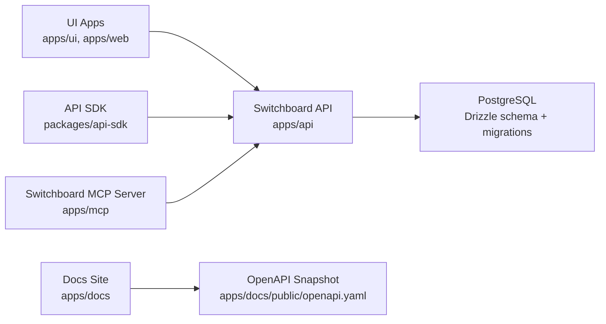
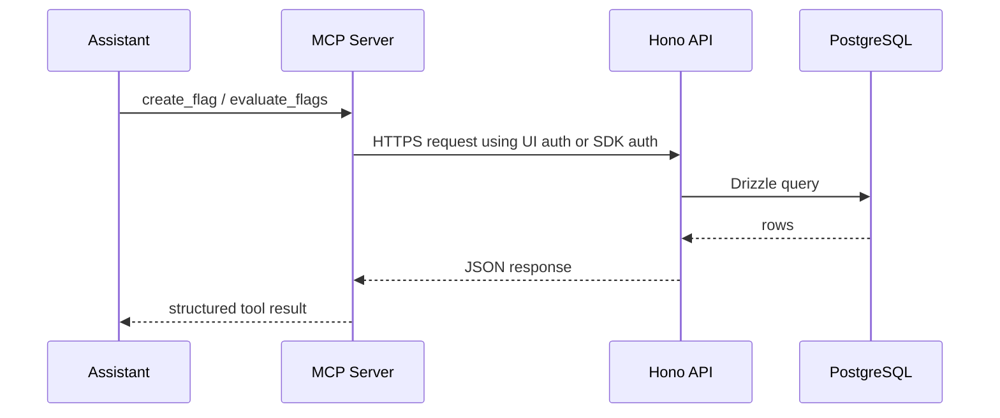

## System Topology

## Core Components

- `apps/api` is the only database-facing service. It owns validation, permissions, and all writes.
- `apps/mcp` is a dedicated MCP server that never talks to PostgreSQL directly. It composes the REST API through `packages/api-sdk`.
- `packages/api-sdk` exposes a typed client for environments, clients, flags, overrides, API keys, and evaluation.
- `apps/docs` is a Starlight-based static docs site that can be hosted on GitHub Pages or any static host.

## Request Flow

## Why The API Boundary Matters

- It centralizes authorization and validation.
- It keeps the MCP server safe and stateless.
- It lets UI apps evolve without embedding persistence logic.
- It aligns with the repo rule from [API Boundary](/architecture/api-boundary/).

## Repository Layout

- `apps/api`: Hono routes, auth middleware, Drizzle schema, migrations
- `apps/mcp`: MCP server, HTTP and stdio transports, resources, prompts, tools
- `apps/docs`: Starlight documentation site
- `packages/api-sdk`: typed REST client for Switchboard consumers
- `packages/ui`: shared UI primitives
