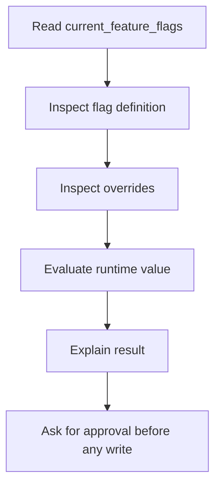

## Resources

### `switchboard://current_feature_flags`

Provides a read-only snapshot of:

- accessible environments
- their current flag inventory

Best for:

- grounding an assistant before a rollout
- reducing hallucinated flag names
- giving an LLM compact current-state context

### `switchboard://best_practices/feature_flags`

Provides structured guidance about:

- naming
- rollout sequencing
- override hygiene
- operational safety

Best for:

- planning prompts
- policy-aware agent workflows
- automated rollout reviews

## Prompts

### `safe_flag_rollout`

Helps an assistant plan a careful flag rollout by nudging it to:

1. inspect current state first
2. verify snake_case naming
3. choose a safe default
4. prefer narrow targeting before broad rollout
5. ask for explicit approval before writes

Example user intent:

- `Plan a safe rollout for dark_mode in production.`

### `debug_flag_evaluation`

Guides an assistant through:

1. reading the current flag definition
2. checking relevant overrides
3. using `evaluate_flags` when credentials exist
4. explaining whether the value came from default, rule, or override

Example user intent:

- `Why is onboarding_revamp false for user 123 in production?`

## Suggested Agent Workflow

